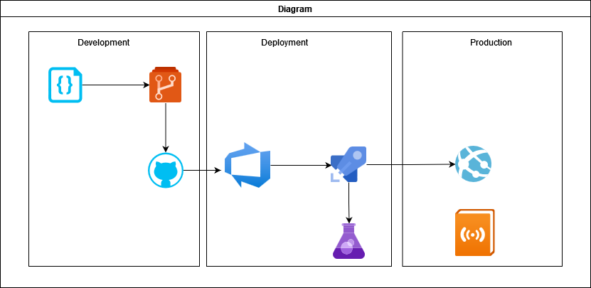
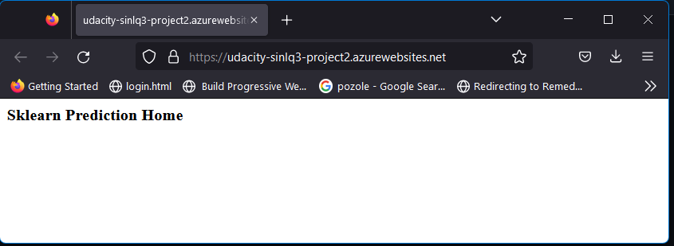
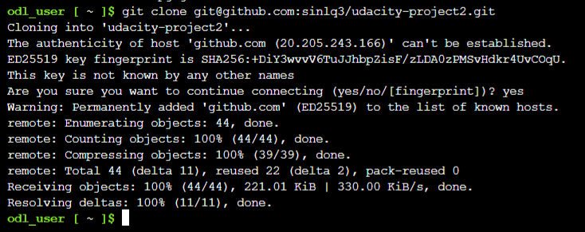
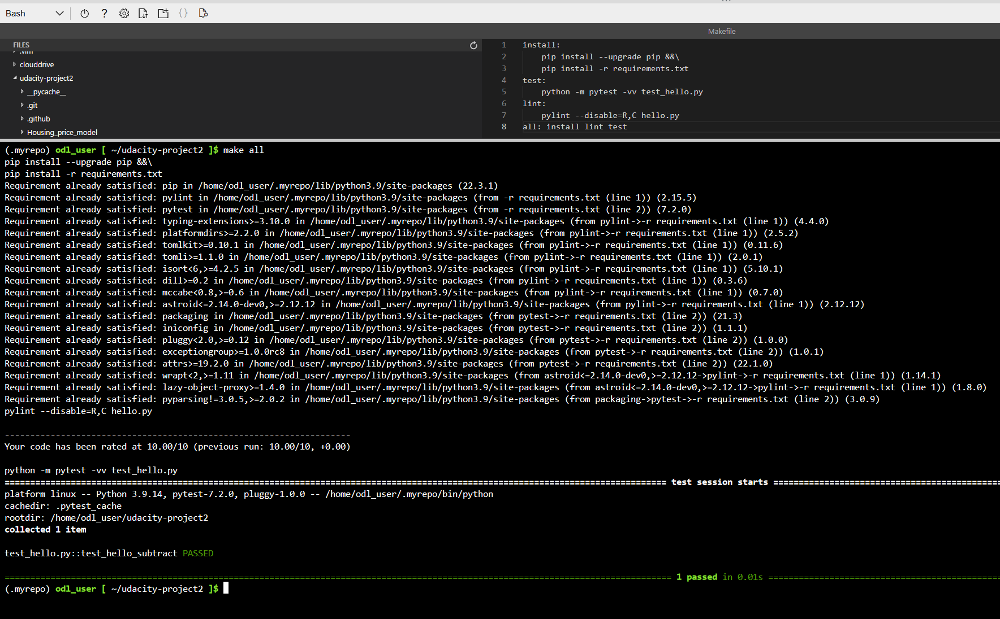
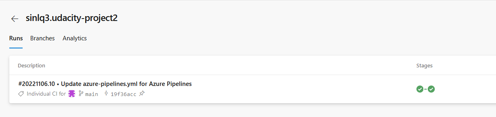
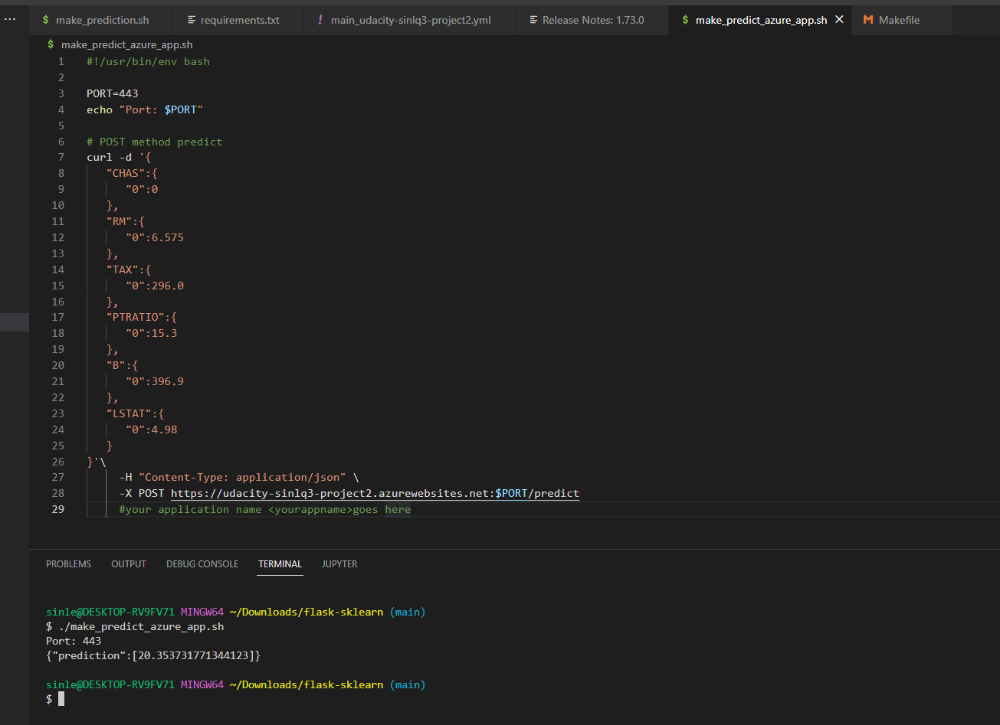

# Overview

This project demos the build & deploy a Python web app to Azure App Service using Azure DevOps Pipeline

## Project Plan

Trello Link: https://trello.com/invite/b/UDJvlop3/ATTI16ee7275e034a98b25308c2ff47681b8F5927F68/udacity-project-2

Project Plan: https://docs.google.com/spreadsheets/d/1kBJSfyPG3l8uV5xkRg5mk2lH5vN6Ak58b4wIA0sIz9c/edit?usp=sharing

## Instructions

* Project running on Azure App Service

* Project cloned into Azure Cloud Shell

* Passing tests that are displayed after running the `make all` command from the `Makefile`

* Output of a test run

* Successful deploy of the project in Azure Pipelines.  [Note the official documentation should be referred to and double checked as you setup CI/CD](https://docs.microsoft.com/en-us/azure/devops/pipelines/ecosystems/python-webapp?view=azure-devops).

* Running Azure App Service from Azure Pipelines automatic deployment

* Successful prediction from deployed flask app in Azure Cloud Shell.  [Use this file as a template for the deployed prediction](https://github.com/udacity/nd082-Azure-Cloud-DevOps-Starter-Code/blob/master/C2-AgileDevelopmentwithAzure/project/starter_files/flask-sklearn/make_predict_azure_app.sh).

## Enhancements

Combine with Terraform to automatically privision Azure Infras before deployment.
Uncomment file "main_udacity-sinlq3-project2.yml" to use GitHub Action instead of Azure Pipeline

## Demo 

I change the text here!
